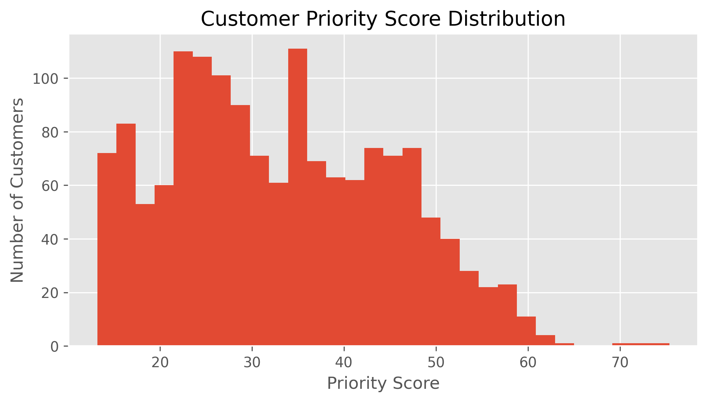
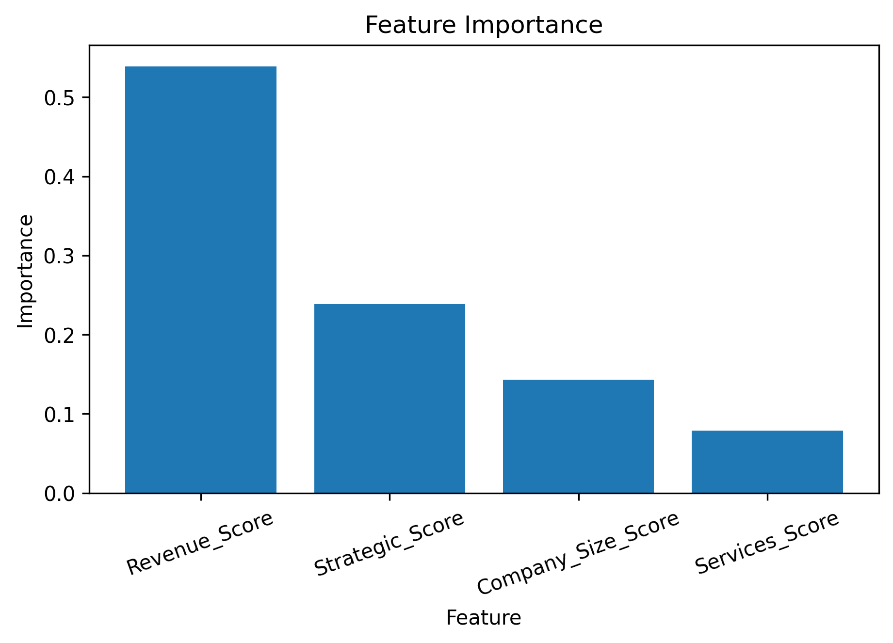

# AI-Based ISP Customer Prioritization

An explainable, data-driven system for prioritizing ISP customers based on business value, strategic importance, subscribed services, and company characteristics.

## Project Overview

Internet Service Providers (ISPs) manage customers with different levels of business value. Since premium support resources are limited, this project develops a systematic approach to identify customers who should receive higher priority.

The project includes:

- Data quality assessment
- Data cleaning
- Exploratory Data Analysis
- Feature engineering
- Customer Priority Scoring
- Customer segmentation using K-Means
- Segment validation using Random Forest
- Business recommendations

## Dataset

The project uses a fully synthetic ISP customer dataset created for educational and portfolio purposes.

The dataset contains approximately 3,000 customer records with information such as:

- Monthly revenue
- Internet bandwidth
- Customer loyalty
- Company size
- Strategic importance
- VoIP services
- Server hosting
- Support history
- Downtime
- Contract type

No real customer information is included.

## Methodology

The project follows this workflow:

Raw Data  
↓  
Data Quality Assessment  
↓  
Data Cleaning  
↓  
Exploratory Data Analysis  
↓  
Feature Engineering  
↓  
Customer Priority Scoring  
↓  
K-Means Customer Segmentation  
↓  
Validation  
↓  
Business Recommendations

The Customer Priority Score is based on four main components:

- Revenue Score
- Strategic Score
- Services Score
- Company Size Score

## Results

The K-Means clustering analysis identified three meaningful customer segments.

The number of clusters was evaluated using the Elbow Method and Silhouette Score.

A Random Forest classifier achieved **99.7% accuracy** in predicting the discovered customer segments, indicating that the segments are highly distinguishable based on the engineered features.

### Customer Priority Score Distribution



### Feature Importance



Feature importance analysis showed that **Revenue Score** was the strongest contributor, followed by **Strategic Score**, **Company Size Score**, and **Services Score**.

## Business Value

The proposed framework can help ISPs:

- Identify high-priority customers
- Allocate premium technical support resources
- Identify strategically important customers
- Support customer relationship management
- Make customer prioritization more transparent and explainable

## Technologies

Python, Pandas, NumPy, Matplotlib, Seaborn, Scikit-learn, Jupyter Notebook

## Repository Structure

```text
AI-Based-ISP-Customer-Prioritization/

├── data/
├── notebooks/
├── outputs/
├── README.md
├── requirements.txt
└── LICENSE